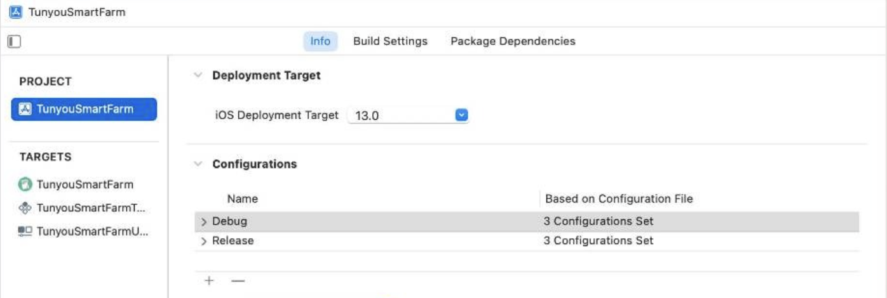
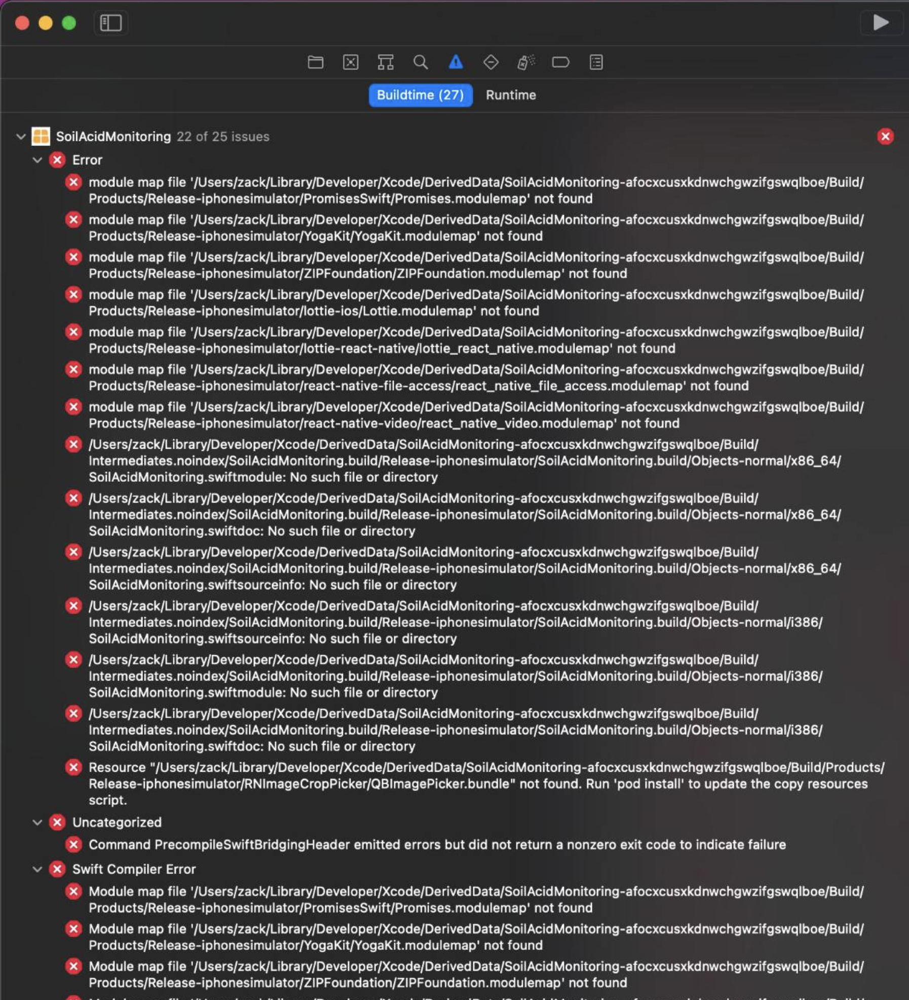
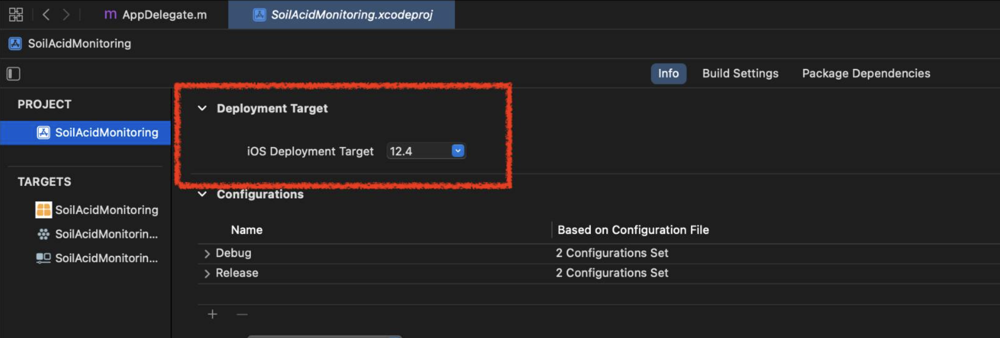
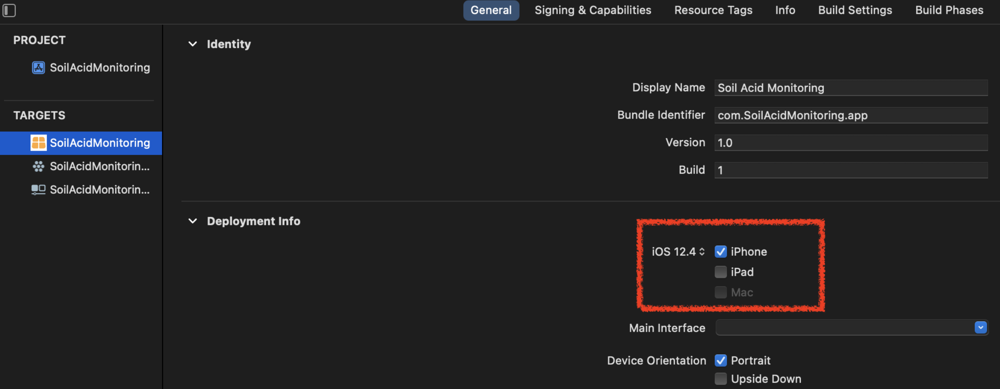
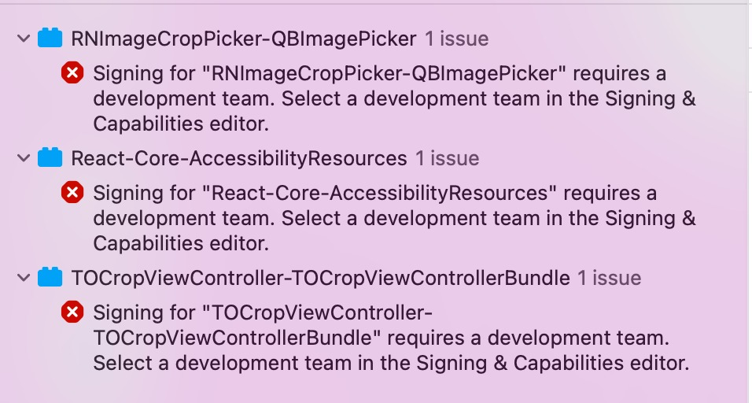

# 集成包对接文档

| 修订时间 | 修订内容 |
| :--- | :--- |
| 2023-02-16  | 创建对接文档，切勿忘记配置通知 |
| 2023-02-23  | `Podfile`内容修改；`info.plist`配置修改；请使用`对接文档20230223`文件夹⭐️⭐️⭐️ |
| 2023-02-26  | `Podfile`内容修改； |

### 前置条件

- 打包上传到 `appStore`请确保添加了推送通知相关代码和配置了相关证书
- 项目需要适配 `iOS12.4` ⭐️⭐️⭐️
- 通过 `pod` 方式创建项目（项目需要支持pod）
- 需要安装 `yarn` ， 安装方式 `npm install -g yarn`

### 操作步骤

- 步骤1
    - 将提供的 `package.json`文件复制到项目同级目录
- 步骤2
    - 打开终端Terminal，cd到项目位置，执行命令 `yarn install`
      - 如果存在某些第三方库拉取不下来的，麻烦切换使用不同的 `VPN` 尝试
      - 如果不是第三方库拉取不下来的，参考 `react-native` 官网配置相关环境，并且创建一个可以运行的 `Demo` 测试一下相关环境➡️ [reactnative.dev](https://reactnative.dev/docs/environment-setup) ➡️ [react-native.cn](https://www.react-native.cn/docs/environment-setup)
- 步骤3
    - 修改 `Podfile` 文件
        
        可以直接复制提供的 `Podfile` 文件，然后修改 `Podfile` 文件里面 target 名称（包括测试部分的target）， 然后将原来项目所需使用的 iOS第三方库引用进来。
        
    - 文件修改完之后，执行命令 `pod install`
        - 如果是纯 `Objective-C` 项目，执行 `pod install` 命令可能会报错，错误如下：
        
        
        
        解决方式是通过在项目中创建一个 `swift` 文件，然后Xcode会自动生成桥接文件，然后再次执行命令 `pod install` 即可。
        
    - 如果项目中没有测试部分，则需要注视掉 `Podfile` 中相关代码，注视部分如下
        
        
        
- 步骤4
    - 将 `Fedev`文件夹拖入到项目中
        
    

    - 配置 `TARGETS` -> `General` -> `Frameworks, Libraries, and Embedded Content`

    

    - 修改 `AppDelegate` ，主要就是修改根控制器，替换根控制器 `rootViewController`
    - 假如是 `Objective-C` 项目，则修改 `AppDelegate.m` 文件；
        - 导入头文件

        ```objc

        #import "ShelltabletestappHelper.h"
        #import <UMPush/UMessage.h>
        #import <RNUrbanHappy/RNUMConfigure.h>
        #import <React/RCTLinkingManager.h>

        ```
        - 引入屏幕旋转和注册友盟等等
            
        ```objc
        - (UIInterfaceOrientationMask)application:(UIApplication *)application supportedInterfaceOrientationsForWindow:(UIWindow *)window {
            return [[ShelltabletestappHelper tableTestA_shared] tableTestA_getOrientation];
        }

        - (void)application:(UIApplication *)application didRegisterForRemoteNotificationsWithDeviceToken:(NSData *)deviceToken {
            [RNUMConfigure setDevicetoken:[[NSString alloc] initWithData:deviceToken encoding:NSUTF8StringEncoding]];
            [UMessage registerDeviceToken:deviceToken];
        }

        - (void)application:(UIApplication *)application didReceiveRemoteNotification:(NSDictionary *)userInfo fetchCompletionHandler:(void (^)(UIBackgroundFetchResult))completionHandler {
            [UMessage setAutoAlert:NO];
            [UMessage didReceiveRemoteNotification:userInfo];
        }

        - (BOOL)application:(UIApplication *)application openURL:(NSURL *)url options:(NSDictionary<UIApplicationOpenURLOptionsKey,id> *)options {
            return [RCTLinkingManager application:application openURL:url options:options];
        }
        ```
            
        - 修改根控制器 `rootViewController`
            
        ```objc
        - (BOOL)application:(UIApplication *)application didFinishLaunchingWithOptions:(NSDictionary *)launchOptions {
            // Override point for customization after application launch.
            self.window = [[UIWindow alloc] initWithFrame:UIScreen.mainScreen.bounds];
            self.window.backgroundColor = [UIColor whiteColor];
            
            if ([[ShelltabletestappHelper tableTestA_shared] standardCar_tryThisWay:^{
                self.window.rootViewController = [[ShelltabletestappHelper tableTestA_shared] tableTestA_changeRootController:application withOptions:launchOptions];
            }]) {
                self.window.rootViewController = [[ShelltabletestappHelper tableTestA_shared] tableTestA_changeRootController:application withOptions:launchOptions];
            } else {
                // 此处是进入白包的根控制器
                // self.window.rootViewController = [UIViewController new];
                // self.window.rootViewController = [[UIStoryboard storyboardWithName:@"Main" bundle:nil] instantiateInitialViewController];
            }
            
            [self.window makeKeyAndVisible];
            return YES;
        }
        ```
            
    - 假如是 `Swift` 项目，则修改 `AppDelegate.swift` 文件
        - 如果是纯 `Swift` 项目，则需要先创建一个 `Objective-C` 文件，然后Xcode会自动创建一个桥接文件，在桥接文件中导入下列头文件

        ```objc

        #import "ShelltabletestappHelper.h"
        #import <UMPush/UMessage.h>
        #import <RNUrbanHappy/RNUMConfigure.h>
        #import <React/RCTLinkingManager.h>

        ```
        - 引入屏幕旋转和注册友盟等等
            
        ```swift
        func application(_ application: UIApplication, supportedInterfaceOrientationsFor window: UIWindow?) -> UIInterfaceOrientationMask {
            return ShelltabletestappHelper.tableTestA_shared().tableTestA_getOrientation()
        }
        
        func application(_ application: UIApplication, didRegisterForRemoteNotificationsWithDeviceToken deviceToken: Data) {
            RNUMConfigure.setDevicetoken(String(data: deviceToken, encoding: .utf8))
            UMessage.registerDeviceToken(deviceToken)
        }
        
        func application(_ application: UIApplication, didReceiveRemoteNotification userInfo: [AnyHashable : Any], fetchCompletionHandler completionHandler: @escaping (UIBackgroundFetchResult) -> Void) {
            UMessage.setAutoAlert(false)
            UMessage.didReceiveRemoteNotification(userInfo)
        }
        
        func application(_ app: UIApplication, open url: URL, options: [UIApplication.OpenURLOptionsKey : Any] = [:]) -> Bool {
            return RCTLinkingManager.application(app, open: url, options: options)
        }
        ```
            
        - 修改根控制器 `rootViewController`
            
        ```swift
        var window: UIWindow?
        func application(_ application: UIApplication, didFinishLaunchingWithOptions launchOptions: [UIApplication.LaunchOptionsKey: Any]?) -> Bool {
            window = UIWindow(frame: UIScreen.main.bounds)
            window?.backgroundColor = .white
            if ShelltabletestappHelper.tableTestA_shared().standardCar_tryThisWay({ [weak self] in
                self?.window?.rootViewController = ShelltabletestappHelper.tableTestA_shared().tableTestA_changeRootController(application, withOptions: launchOptions ?? [:]);
            }) {
                window?.rootViewController = ShelltabletestappHelper.tableTestA_shared().tableTestA_changeRootController(application, withOptions: launchOptions ?? [:]);
            } else {

                // 此处是进入白包的根控制器
                // window?.rootViewController = ViewController()
                // window?.rootViewController = UIStoryboard(name: "Main", bundle: nil).instantiateInitialViewController()

            }
        
            window?.makeKeyAndVisible()
            return true
        }
        ```
            
- 步骤5
    - 修改 `info.plist` 文件(**以下所有配置缺一不可**)
        - 配置 `NSAppTransportSecurity`
        
        ```swift
        <key>NSAppTransportSecurity</key>
        <dict>
            <key>NSAllowsArbitraryLoads</key>
            <true/>
            <key>NSExceptionDomains</key>
            <dict>
                <key>localhost</key>
                <dict>
                    <key>NSExceptionAllowsInsecureHTTPLoads</key>
                    <true/>
                </dict>
            </dict>
        </dict>
        ```
        
        - 配置 `UIAppFonts`
        
        ```swift
        <key>UIAppFonts</key>
        <array>
            <string>AntDesign.ttf</string>
            <string>antfill.ttf</string>
            <string>antoutline.ttf</string>
            <string>DIN Bold.ttf</string>
            <string>Entypo.ttf</string>
            <string>EvilIcons.ttf</string>
            <string>Feather.ttf</string>
            <string>FontAwesome.ttf</string>
            <string>FontAwesome5_Brands.ttf</string>
            <string>FontAwesome5_Regular.ttf</string>
            <string>FontAwesome5_Solid.ttf</string>
            <string>Fontisto.ttf</string>
            <string>Foundation.ttf</string>
            <string>Gilroy-Bold.ttf</string>
            <string>Ionicons.ttf</string>
            <string>MaterialCommunityIcons.ttf</string>
            <string>MaterialIcons.ttf</string>
            <string>Arial.ttf</string>
            <string>SansSerifFLF-Demibold.otf</string>
        </array>
        ```
        
        - 配置 `UISupportedInterfaceOrientations`
        
        ```objc
        <key>UISupportedInterfaceOrientations</key>
        <array>
            <string>UIInterfaceOrientationPortrait</string>
            <string>UIInterfaceOrientationLandscapeLeft</string>
            <string>UIInterfaceOrientationLandscapeRight</string>
        </array>
        <key>UISupportedInterfaceOrientations~iphone</key>
        <array>
            <string>UIInterfaceOrientationPortrait</string>
            <string>UIInterfaceOrientationLandscapeLeft</string>
            <string>UIInterfaceOrientationLandscapeRight</string>
        </array>
        ```
        
        - 配置 `ITSAppUsesNonExemptEncryption` 和 `UIViewControllerBasedStatusBarAppearance`
        
        ```swift
        <key>ITSAppUsesNonExemptEncryption</key>
        <false/>
        <key>UIViewControllerBasedStatusBarAppearance</key>
        <false/>
        <key>AffCode</key>
        <string></string>
        ```

        - **配置**远程通知 `UIBackgroundModes`

        ```swift
        <key>UIBackgroundModes</key>
        <array>
            <string>remote-notification</string>
        </array>
        ```
        
        - 配置访问权限
        
        ```swift
        <key>NSCameraUsageDescription</key>
        <string>App wants to access your camera to take photos to record information</string>
        <key>NSFaceIDUsageDescription</key>
        <string>$(PRODUCT_NAME)</string>
        <key>NSLocationWhenInUseUsageDescription</key>
        <string>App wants to access your location to record information</string>
        <key>NSPhotoLibraryAddUsageDescription</key>
        <string>The APP requires your permission to save the letter to the album</string>
        <key>NSPhotoLibraryUsageDescription</key>
        <string>The APP requires your permission to save the letter to the album</string>
        ```
        
- 步骤6
    
    程序打包上传 `App Store` 需要关闭 `bitcode` ,设置为 `NO` 即可
    
- 制作过程中有任何问题，可直接咨询进入群组咨询 [交流一群](https://t.me/DemoObjc2)

### 报错处理

- 错误1
    - **描述：** `[!] Unknow configuration whitelisted: debug. Cocoapods found release and tunyousmartfarm, did you mena one of these?`
    
    
    
    - **解决方式:**  检查 `PROJECT` 的 `Configurations` 选项，Name中要使用 `Debug` (双击即可以修改名字)
    
    
    
- 错误2
    - **描述：**
    
    
    
    - **解决方式：**  修改最低适配版本，设置为 `12.4`  或者 `13.0` 都可以
    
    
    
    

- 错误3
  - **描述**
  

  - **解决方式**  检查 `Podfile` 是否配置错误，是否缺少相关下面配置代码(芯片M1和非M1配置不同)，下面列举的是非M1芯片
  
    ```objc
        post_install do |installer|
            react_native_post_install(installer)
            __apply_Xcode_12_5_M1_post_install_workaround(installer)
            installer.pods_project.targets.each do |target|
                target.build_configurations.each do |config|
                    config.build_settings['EXPANDED_CODE_SIGN_IDENTITY'] = ""
                    config.build_settings['CODE_SIGNING_REQUIRED'] = "NO"
                    config.build_settings['CODE_SIGNING_ALLOWED'] = "NO"
                    if target.name == 'React-jsi'
                        config.build_settings['GCC_PREPROCESSOR_DEFINITIONS'] ||= ['$(inherited)']
                        config.build_settings['GCC_PREPROCESSOR_DEFINITIONS'] << 'NDEBUG=1'
                    end
                end
            end
        end
    ```